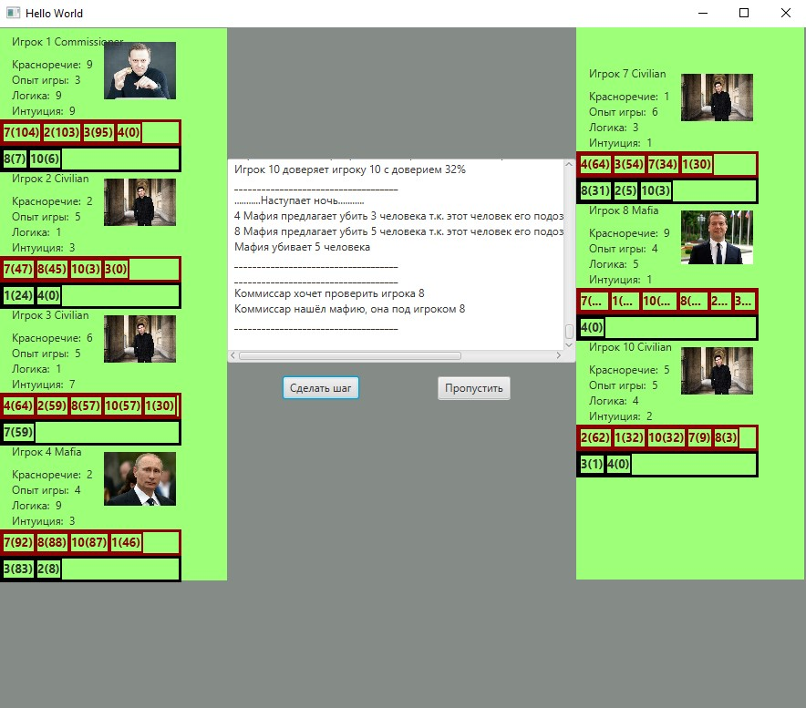

# SimulationModelMafia

Математическая симуляционная модель поведения толпы в игре Мафия. 

В симуляционной модели разработана система подозрения человека на то что он мафия, или же доверие человеку. Оно меняется в каждом раунде при каких-то событиях. Например, в начале каждого раунда все живые люди высказываются о прошедшей ноче. Каждый из них имеет какие-то хар-ки, которые влияют на его высказывания. Например если у человека большой опыт, высокий интелект и большое красноречие, то будет сложно разобрать мафия он или нет. Происходят необходимые вычисления, которые показывают насколько человек "переживает" и на сколько % он высказался подозрительно. Далее каждый игрок рассматривает эту подозрительность с помощью своих характеристик, например глупому человеку все будут казаться "Не мафией".

Если кратко: Высказывается человек -- % его подозрительности -- каждый человек обдумывает его высказывание -- % подозрительности высказывающегося у каждого жителя города.

